Well, I learned on Duolingo and I'm currently on a 1200-day streak. That's how I got my first job in the USA. In this post, I will explain how I started and how I managed to maintain the streak for over three years.

## The Beginnings

In school, learning English was very important to me, but my family didn't have enough money to enroll me in an academy. However, I did have internet, and with it, I could experiment with YouTube. Back then, there wasn't as much English content as there is now, but either way, I wasn't encouraged to consume that content. I thought I could learn by changing my environment to English. So I set myself some guidelines:

- Have my phone's language set to English

- Facebook's language also in English

- Finally, watch movies with English subtitles

## The Evolution

With these guidelines, started at age 15, I learned many concepts, but all limited to settings and applications, as I continued to consume content in Spanish, which meant my vocabulary didn't grow much. Nevertheless, I continued with this method until after entering university. At university, I tried many times to maintain a consistent Duolingo streak, but I often lost it. Still, I had an interesting foundation with which I could understand some intermediate texts and news.

## Duolingo

Everyone said English was important, and I knew it well, but I wasn't able to study anything. I felt like I wasn't making any progress and that I always had the same level as in school. One day, my professor Rony Hancco held a habits workshop based on Atomic Habits, and I discovered a simple but very effective method to never stop doing my lessons: **“make it visible.”** By simply replacing my most frequent applications with the Duolingo app, I managed to open it more often through “muscle memory.” It wasn't easy; I reached my first 170-day streak the first time and lost it. It hurt a lot; even so, I continued trying from scratch and reached 365 days. A full year of practicing. And so I discovered that the problem was discipline, not just knowledge.

## Work Environment

In 2021, I got a job at Devsu. During the interview, they asked me to answer a few questions in English. They asked me how I would build a giant, global-scale system—the question wasn't that easy, much less in English. I was very fortunate to learn that they finally hired me and sent me to do some interviews with corporate clients so they could assign me to a project. It didn't go entirely well: in a real environment, I froze, didn't understand much of what they were saying, and felt too insecure about myself.

## Takeoff

I changed my environment and content consumption again. I started watching series entirely in English with English subtitles, and I also started following more English content creators. Although it was hard to understand at first, I didn't mind it and pushed myself to continue consuming increasingly advanced and fast-paced content. Or rather, **REAL** content. This allowed me to fine-tune my ear and better associate sounds with meanings directly. Previously, I used to have the following complex flow:

```mermaid
graph TD
  S[Sonido en inglés] --> T[Texto]
  T --> TR[Traducción]
  TR --> SG[Significado]
```

With this flow, my brain became very slow when listening to English words. Little by little, I understood that practice made such complicated things easier. That comforted me and encouraged me to continue.

## Work in the USA 🇺🇸

In 2024, I applied to over 100 companies, all of which were foreign. This process was slow and required patience and preparation (I'll tell the full story in another post). The best of all those jobs was to work 100% remotely in the USA. If I hadn't decided years ago to start practicing English every day, I wouldn't have gotten it, given that I passed more than five interviews in English with different people involved. And in all of them, I stood out even though my English wasn't perfect.

## Conclusion

If you really want to learn English well, you must not only have willpower but also discipline; it's something that is built every day.