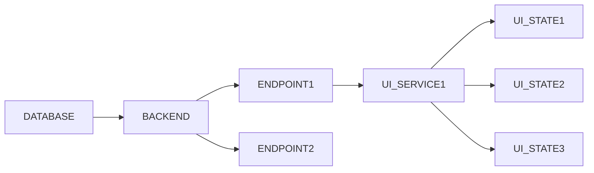
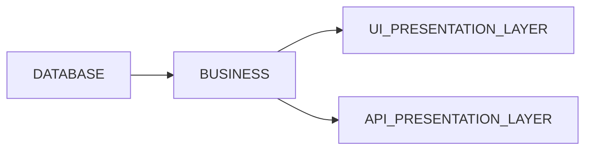

I finally stopped using frontend frameworks. I started in the web development world using Angular, then I preferred Vue, and at Devsu I used React. Now, I use none. Why? In this article, I will explain in detail what led me to make this decision.

## State management

Imagine you have a CRUD application. The process to implement it using YouTube tutorials for beginner developers, as I was initially, would be the following:
- Define database model
- Choose a database engine
- Choose a backend framework. This could be Express.js, Nest.js, or Hono
- Implement a REST API in this backend
- Choose a frontend framework. This could be Angular, Vue, or React.
- Implement services that consume the REST API
- Implement the UI

Can you already see what the problem is here?



## How a web application should look

We all know that we should separate the presentation layer from the business layer. It's something we often forget. In a web application, HTML is just another presentation layer, made of text.



Servers are good at serving and returning text, any kind of text, not just JSON.😉

## HTMX

In my latest projects, I have consistently used HTMX. This has significantly accelerated development, as I no longer program two independent projects—one for frontend and one for backend—but only the backend, dictating how each part of the web should be updated. This has also allowed me to see things differently. Sometimes it is also much easier to create a custom HTML component instead of handling forms in strange ways, such as creating a long list of useState, as in the following example:

```jsx
import { useState } from 'react';

function Form() {
  const [name, setName] = useState('');
  const [email, setEmail] = useState('');
  const [password, setPassword] = useState('');
  const [confirmPassword, setConfirmPassword] = useState('');
  const [address, setAddress] = useState('');
  const [city, setCity] = useState('');
  const [state, setState] = useState('');
  const [zip, setZip] = useState('');
  const [country, setCountry] = useState('');
  const [phone, setPhone] = useState('');
  const [submitted, setSubmitted] = useState(false);
  const [error, setError] = useState(null);

  // ...
}
```

There are also other horrifying examples online, like this one: [An image displaying a complex and hard-to-read code example was formerly here.]

I wonder if it's necessary to have all this mess of states. Why do we have to live like this? I feel that since I started using HTMX, my web apps have significantly simplified and improved.

Yes, I know. A project can be developed with much cleaner and tidier code than this, but unfortunately, that is not the most common practice.

Anyway, I do enjoy writing code in Flutter, for which I cannot render directly from the server, can I? I like the language (Dart), I think it's a modern and easy-to-use language. However, I have really liked GetX for state management because the abstraction is super intuitive. It is one of the best frameworks I have seen.
