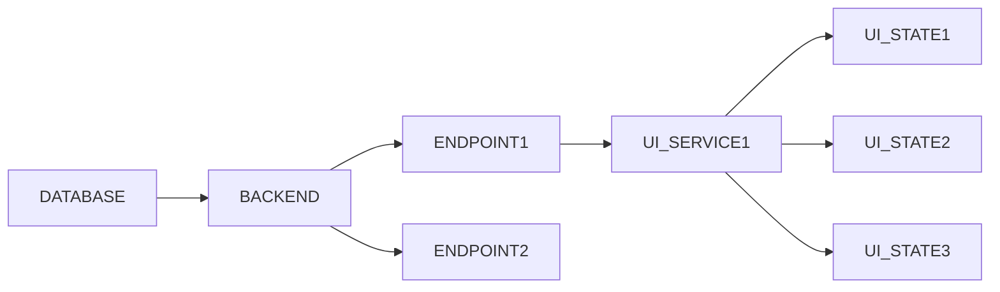
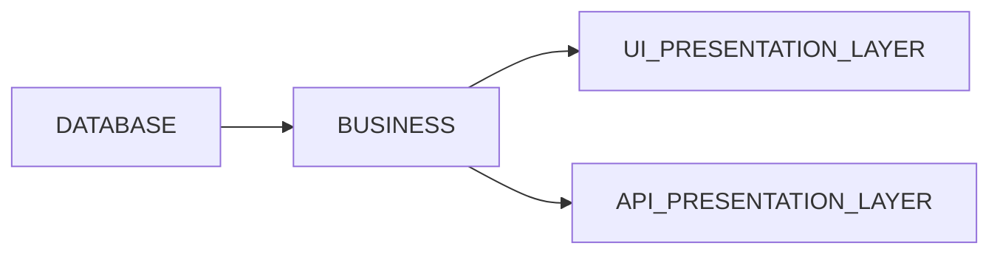

I finally stopped using frontend frameworks. I started in the web development world using Angular, then I liked Vue more, and at Devsu, I used React. Finally, now I don't use any. Why? In this article, I will explain in detail what led me to make this decision. 

## State management

Imagine you have a CRUD application. The process to carry it out with YouTube tutorials and for beginner developers, as I was initially, would be the following:

- Define database model

- Choose a database engine

- Choose a backend framework. It could be Express.js, Nest.js, or Hono

- Implement a REST API in this backend

- Choose a frontend framework. It could be Angular, Vue, or React.

- Implement services that consume the REST API

- Implement the UI

Can you already see what the problem is here? 

## How a web application should look

We all know that we should separate the presentation layer from the business layer. It's something we often forget. In a web application, HTML is just another presentation layer, made of text. 

Servers are good at serving and returning text, any type of text, not just JSON. 😉 

## HTMX

In my recent projects, I have consistently used HTMX. This has accelerated development because instead of programming two independent projects, one for frontend and one for backend, only the backend is programmed, showing how each part of the web should be updated. This has also allowed me to see things differently. Sometimes it's also much easier to create a custom HTML component instead of handling forms in strange ways, such as creating a long list of useState, as in the following example:

On the internet, there are also other horrible examples, like this one: 

I wonder if it's necessary to have all this tangle of states. Why do we have to live like this? I feel that since I started using HTMX, my web apps have been significantly simplified and improved.

Yes, I know. A project can be developed with much cleaner and more organized code than this, but unfortunately, that's not the most common.

Anyway, I do enjoy writing code in Flutter, for which I _cannot_ render directly from the server, right? I like the language (Dart), I think it's a modern and easy-to-use language. I've also really liked GetX for state management because the abstraction is super intuitive. It's one of the best frameworks I've seen. 

In conclusion, I believe that frontend web development is returning to its beginnings in a simpler and more accessible way. I will probably soon do a tutorial on how to make an E2E server using only Elysia or Hono and HTMX.

