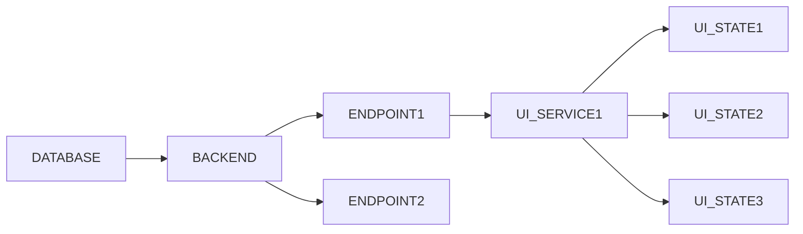
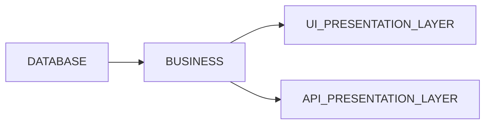

Finalmente deje de usar frontend frameworks. Empecé en el mundo de desarrollo web usando Angular, luego me gustó más Vue y en Devsu usé React. Finalmente ahora no uso ninguno. ¿Por qué? En este artículo explicaré de manera detallada qué me llevó a tomar esta decisión. 

## State management

Imagina que tienes una aplicación CRUD. El proceso para llevarla a cabo con los tutoriales de YouTube y para desarrolladores principiantes, como yo fui en un inicio, sería el siguiente:

- Definir modelo de base de datos

- Escoger un motor de base de datos

- Escoger un framework backend. Puede ser Express.js, Nest.js u Hono

- Implementar una REST API en este backend

- Escoger un framework frontend. Puede ser Angular, Vue o React.

- Implementar servicios que consuman la API REST

- Implementar la UI

¿Ya se puede observar cuál es el problema aquí? 

## Cómo debería verse una aplicación web

Todos sabemos que deberíamos separar la capa de presentación de la capa de negocio. Es algo que muchas veces olvidamos. En una aplicación web, el HTML es una capa de presentación más, hecha de texto. 

Los servidores son buenos sirviendo y retornando texto, cualquier tipo de texto, no sólo JSON. 😉 

## HTMX

En mis últimos proyectos he utilizado HTMX de forma seguida. Esto ha permitido acelerar el desarrollo dado que ya no se programan dos proyectos de forma independiente, uno para frontend y otro para backend sino sólo backend y mostrando cómo debería actualizarse cada parte de la web. Esto también ha permitido que vea las cosas de forma diferente. A veces también es mucho más fácil crear un custom component de HTML en lugar de manejar los formularios de formas extrañas, como creando una larga lista de useState, como en el siguiente ejemplo:

En internet también hay otros ejemplos horrorosos, como este: 

Yo me pregunto si es necesario tener toda esta maraña de estados. ¿Por qué tenemos que vivir así? Siento que desde que uso HTMX mis web apps se han simplificado significativamente y se ha mejorado. 

Sí, ya sé. Se puede desarrollar un proyecto con código mucho más limpio y ordenado que esto, pero lamentablemente eso no es lo más común.

De cualquier forma, sí disfruto escribir código en Flutter, para el cual _no puedo_ renderizar directamente desde el servidor, ¿verdad? Me gusta el lenguaje (Dart), creo que es un lenguaje moderno y fácil de usar. También me ha gustado mucho GetX para manejar los estados pues la abstracción es super intuitiva. Es de los mejores frameworks que he visto. 

En conclusión, creo que el desarrollo web frontend está volviendo a sus inicios de una manera más sencilla y accesible. Es probable que pronto haga un tutorial sobre cómo hacer un servidor E2E usando sólo Elysia u Hono y HTMX. 

